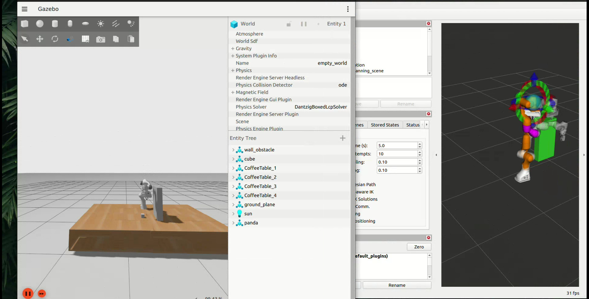

# Panda Robot Arm Project

## Demo Video
click on the image to play video

[](https://drive.google.com/file/d/1zhInSWqQrIv64tRTlV035u_HbHlNKw5r/view)


## Structure
The workspace contains the following packages:
- **panda_bringup**: Main launch files and demo scripts.
- **panda_controller**: configurations for ros2_control.
- **panda_description**: URDF descriptions and Gazebo plugins.
- **panda_moveit**: MoveIt 2 configuration and config files.
- **pymoveit2**: A helper library for easier MoveIt 2 Python interactions.

## Prerequisites
- Ubuntu 22.04 (Jammy Jellyfish)
- ROS 2 Humble Hawksbill
- Gazebo
- MoveIt 2
- Gazebo Fortress

## Installation & Build

1.  **Create the Workspace**:
    ```bash
    mkdir -p ~/arm_ws
    ```

2.  **Clone this Repository**:
    ```bash
    git clone https://github.com/rohitkunnath/collision_avoidance.git
    ```

3.  **Setup the Workspace**:
    Copy the `src` folder from the cloned repository directly to your workspace.

4.  **Build the Workspace**:
    Navigate to the workspace root and build using colcon.
    ```bash
    cd ~/arm_ws
    colcon build
    ```

5.  **Source the Workspace**:
    ```bash
    source install/setup.bash
    ```

## Usage

###  Launch the Simulation
This command launches Gazebo, spawns the Panda robot and starts MoveIt 2 and RViz.
```bash
ros2 launch panda_bringup demo.launch.py
```

